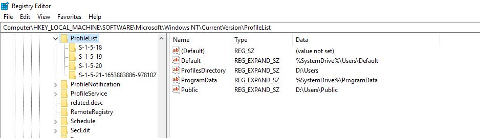

# Windows 10 Linux Subsystem development setup

The purpose of this repo is to include all of the needed tools, scripts and steps for setting up a development enviroment on Windows 10 with Linux subsystem.

I am using [MSI PL60 Gamer Notebook (Intel i7-7500U, 32GB, 250GB SSD + 1TB HDD, NVIDIA GTX 1050 2GB, Killer AC Wifi, 15.6" Full HD IPS, Windows 10) ](https://www.amazon.com/gp/product/B073R3N5RC/ref=oh_aui_search_detailpage?ie=UTF8&psc=1).
One of the initial steps that I have to do is to reset the location of the `User Profiles` due to solid state drive space.

## Initial Windows 10 Setup with User Profile on D: drive

1. [Install clean version of Windows 10](https://www.microsoft.com/en-us/software-download/windows10)
 -Create User `Admin` then upon login into Windows run `Windows Update`

2. Update location of User Profiles.
 - Run Regedit in command prompt `[HKEY_LOCAL_MACHINE\SOFTWARE\Microsoft\Windows NT\CurrentVersion\ProfileList]`
 - Update entries for `ProfilesDirectory` and `Public` profile per this image.
 

3. Add a new user without a password `Root`

4. Don't log off the `Admin` user but log in as newly created user `Root`, if registry modification was correct then newly created provide should be created under `D:\Users`

5. Enable Developer mode.

## Install Visual Studio Code Insider edition with Git Win edition

1.[Download and Install Visual Studio Code Insider](https://code.visualstudio.com/docs/?dv=win&build=insiders)

2. [Install Settings Sync](https://marketplace.visualstudio.com/items?itemName=Shan.code-settings-sync)
 - there was an issue with setting up this extension I had to manually enable prompt for GISTID.

3. [Install Git for Windows](https://git-scm.com/download/win). Accept all of the defaults.

4. [Install Latest .NET SDK](https://www.microsoft.com/net/learn/dotnet/hello-world-tutorial#windowscmd)

## Install and Configure Kubernates on Docker

1. Control Panel --> Turn Windows Feature on or off --> Windows Hypervisor Platform or [powershell script](https://docs.microsoft.com/en-us/virtualization/hyper-v-on-windows/quick-start/enable-hyper-v)
```
    Enable-WindowsOptionalFeature -Online -FeatureName Microsoft-Hyper-V -All
```

2. Disable legacy features of Windows with [Vulnerability SMB 1.0/CIFS File Sharing Support](https://www.zdnet.com/article/windows-10-tip-stop-using-the-horribly-insecure-smbv1-protocol/)

```cmd
    Enable-WindowsOptionalFeature -Online -FeatureName smb1protocol
```


3. [Downlaod and Install Docker Edge](https://docs.docker.com/docker-for-windows/edge-release-notes/)

## Install Windows Subsystem Linux (WSL) on Windows:

1. Open Powershell `Run as Administrator` and run this script to enable WSL [Install the Windows Subsystem for Linux](https://aka.ms/wslinstall):

```cmd
  Enable-WindowsOptionalFeature -Online -FeatureName Microsoft-Windows-Subsystem-Linux
```

2. Windows Store and choose flavor of Linux: `Ubuntu`

3. Launch Ubuntu.exe from the Start Menu. Enter a username:`root` and password: `secret` (for sudo command)

4. Update the System
`-y` flag supply `YES` answer to the upgrade.

```bash
    sudo apt-get update 
    sudo apt-get -y upgrade

    #correct the problem if occurred
    sudo dpkg --configure -a
    sudo apt autoremove
```
## Installing Developers' tools

Now we are ready to install developers' tools on both system. Unfortunately WSL doesn't recognize installed apps, so we have to have copies of the software to be installed on both.
For example, I installed `Git` but I also now need to install `Git` on WSL as well.

- [Setup Windows 10](./win10-dev-tools.md)
- [Setup WSL](./wsl-dev-tools.md)