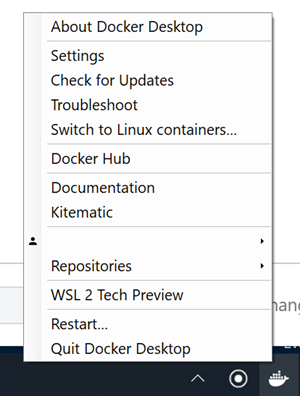
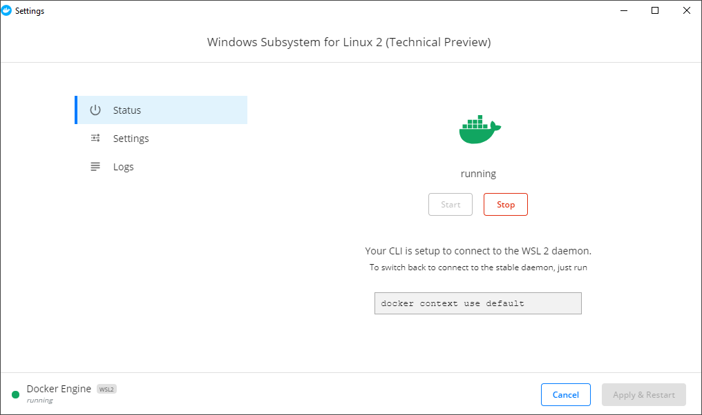

# Installing Docker Desktop WSL 2 Tech Preview

The original documentation that this document was based on can be found [here](https://docs.docker.com/docker-for-windows/wsl-tech-preview/).

## Prerequisites

1. Upgrade to Windows 10 Insider Preview Version build `18932` or later. (10.0.18970 Build 18970)

2. Enable WSL 2 feature on Windows [Microsoft reference](https://docs.microsoft.com/en-us/windows/wsl/wsl2-install) and Install Ubuntu 18.04 [detailed steps](./wsl-install.md).

List all of the distributions installed:

```bash
    wsl lsb_release -a
```

3. Ensure the Ubuntu distribution runs in WSL 2 mode. WSL can run distributions in both v1 or v2 mode.

To check the WSL mode, run:

`wsl -l -v`

To upgrade to v2, run:

`wsl --set-version <distro name> 2`

[User Experience Changes Between WSL 1 and WSL 2](https://docs.microsoft.com/en-us/windows/wsl/wsl2-ux-changes)

4. Set Ubuntu 18.04 as the default distribution.

`wsl -s ubuntu 18.04`

## Download Latest Edge Docker Desktop

[Docker Desktop for Windows Edge Release](https://docs.docker.com/docker-for-windows/edge-release-notes/).

## Installation and Configuration

- Installation of the docker hasn't changed, but once installed there is a new option `WSL 2 Tech Preview` to enable the Preview.


-  New WSL context created


To toggle between context

```bash
    # list all docker contexts
    docker context ls
    
    # the VM based context that enables Kubernetes
    docker context use default

    # new WSL2 context
    docker context use wsl
```
